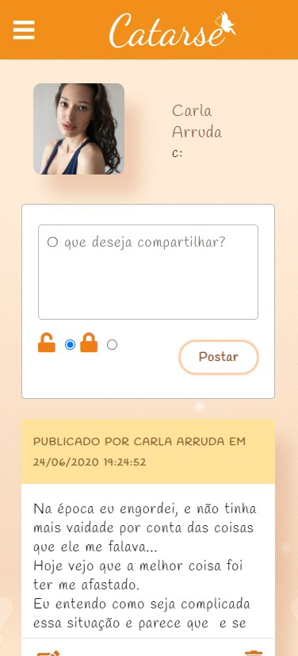
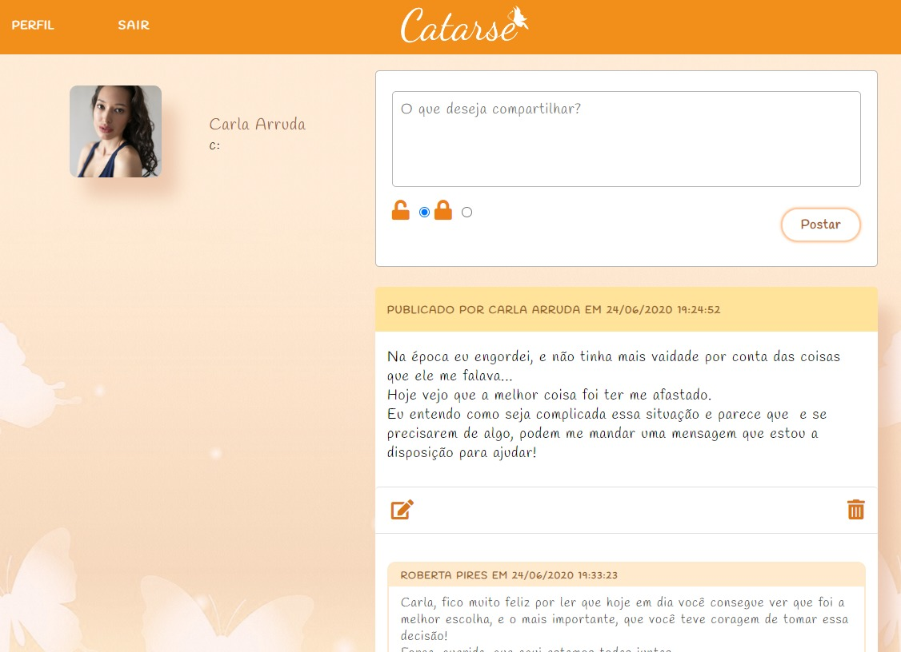
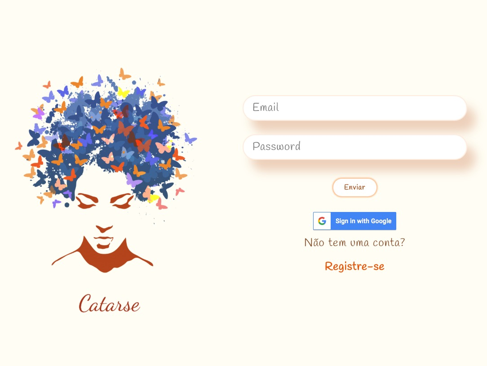

# Criando uma Rede Social

## Índice

* [1. Resumo do projeto](#1-resumo-do-projeto)
* [1.2 Objetivo da rede social](#1.2-objetivo-da-rede-social)
* [2. Desenvolvimento](#2-desenvolvimento)
* [3. Funcionalidades](#5-funcionalidades)
* [4. Considerações Técnicas](#4-considerações-técnicas)
* [4.1 Tecnologias utilizadas](#4.1-tecnologias-utilizadas)
* [4.2 Scripts](#4.2-scripts)
* [5. Autoras](#5-autoras)

***

## 1. Resumo do projeto

Neste projeto realizamos a construção de uma rede social através da manipulação e persistência de dados através de um banco de dados não relacional e em tempo real. 

Construímos o layout respeitando o protótipo passado.

* Protótipo desktop

* Protótipo mobile

--------------------------

Protótipo final Feed

 

Protótipo final Login

 

----------------------

## 1.2 Definição do tema 
Esta rede social tem como objetivo tratar de maneira segura e confortável uma questão que faz parte da rotina de muitas mulheres, que é a violência doméstica, visto que durante essa quarentena o número de casos tem aumentado drasticamente.
Neste canal, o usuário poderá compartilhar suas experiências, pedir por ajuda e também ajudar outras mulheres a superarem esse obstáculo.

* Logo: A borboleta é considerada por muitos povos como um símbolo de tranformação e renovação, 

* Nome: A palavra Catarse é usada para definir o processo de cura emocional através da Psicanálise, que consiste na cura através da libertação de pensamentos, sentimentos, e experiências traumáticas vividas até então.

----------------------

## 2. Desenvolvimento
  O desenvolvimento do projeto se deu a partir da divisão de histórias de usuário, as quais já foram entregues definidas, que foram sendo completadas uma a uma ao decorrer das sprints.
  Nelas priorizamos o término de casa HU para poder dar seguimento as funcionalidades descritas no próximo tópico.

  ----------------------

## 3. Funcionalidades
  A rede social permite que o usuário:
  * Crie uma conta com email e senha válidos, assim sendo direcionado para a página de login para entrar na plataforma;

  * O usuário poderá visualizar as informações fornecidas no momento do cadastro na página de perfil e editá-las;

  * Também na página de perfil, este terá a opção de ver todos os seus posts criados até o momento (sejam eles públicos ou privados), com seus comentários, likes e tipo de privacidade. *obs: caso não possua nenhuma publicação, a página ficará apenas com o perfil à mostra*;

  * Como usuário logado, este poderá fazer publicações, editá-las, mudar sua privacidade e deletá-las;

  * Na página feed, o usuário poderá visualizar tanto seus posts quando os dos outros usuários, podendo estes curtir e comentar;

  * Caso o usuário comente em uma publicação alheia, poderá também editá-los e deletá-los;

  * Caso goste de alguma publicação, poderá curti-la ou descurti-la futuramente;

  * O usuário também possui a opção de logar com o google, caso não queira preencher os dados do registro.

----------------------

## 4. Considerações Técnicas 
Esta aplicação é uma Single-Page Application(*SPA*) e foi criada a partir do mobile first, o que a torna responsiva.

Os arquivos nomeados como *data.js* dentro de cada uma das pastas contém as funções do Firebase e aqueles nomeados como *main.js* possuem a manipulação do DOM e a criação de template strings.

----------------------

## 4.1 Tecnologias utilizadas
* JavaScript(ES6+)
* HTML5
* CSS3
* Firebase Hosting
* Firebase Firestore
* Firebase Auth
* LocalStorage
* EsLint (Airbnb)

## 4.2 Scripts

Para que o você consiga rodar o projeto em sua máquina, terá que:
  Instalar em sua máquina o Node.js e o npm;

  utilizar os comandos: 
  * ``npm install`` - irá instalar as dependências do projeto;

  * ``npm start`` - Para rodar um aplicativo no navegador e inializar o servidor utilizando a URL ``http://localhost:5000``

----------------------

## 5. Autoras
:cherry_blossom: Marjorie Santos https://github.com/MarjorieSantos

:cherry_blossom: Natasha Rodrigues https://github.com/narodrigues

----------------------